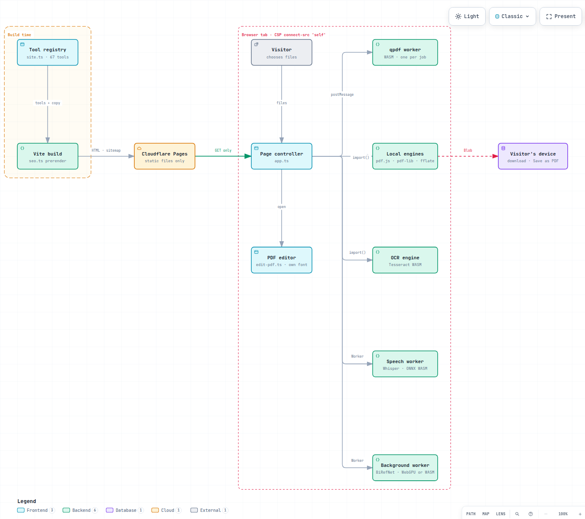

<p align="center">
  <picture>
    <source media="(prefers-color-scheme: dark)" srcset="docs/assets/logo-dark.svg">
    
  </picture>
</p>

<h3 align="center">Free, private tools for PDF, images, audio, Word, Excel and PowerPoint that never see your files.</h3>

<p align="center">
  68 tools — compress, convert, edit, redact, remove backgrounds, merge, split, cut, OCR, transcribe — running <strong>100% in your browser</strong>.<br>
  <strong>No uploads. No sign-up. No watermark. No limits. Free forever. 16 languages.</strong>
</p>

<p align="center"><sub>Open source. Edits PDF text in the file’s own font, transcribes audio with Whisper on your device, and never hands your files to anyone.</sub></p>

<p align="center">
  <a href="https://fizzdoc.com"><strong>Open Fizzdoc →</strong></a> &nbsp;·&nbsp;
  <a href="#-all-68-tools"><strong>All tools</strong></a> &nbsp;·&nbsp;
  <a href="#-how-it-works"><strong>How it works</strong></a> &nbsp;·&nbsp;
  <a href="CONTRIBUTING.md"><strong>Contribute</strong></a>
</p>

<p align="center">
  <a href="https://github.com/kingrishabdugar/fizzdoc/stargazers"></a>
  <a href="https://github.com/kingrishabdugar/fizzdoc/actions/workflows/ci.yml"></a>
  <a href="LICENSE"></a>
  
  
  
  
  <a href="CONTRIBUTING.md"></a>
</p>

<p align="center">
  <a href="https://fizzdoc.com"></a>
  <a href="https://github.com/kingrishabdugar/fizzdoc/issues?q=is%3Aissue+is%3Aopen+label%3A%22good+first+issue%22"></a>
  <a href="https://github.com/kingrishabdugar/fizzdoc/issues?q=is%3Aissue+is%3Aopen+label%3A%22new+tool%22"></a>
  <a href="https://github.com/kingrishabdugar/fizzdoc/commits/main"></a>
  <a href="https://github.com/kingrishabdugar/fizzdoc/issues?q=is%3Aissue+is%3Aopen+label%3Ahacktoberfest"></a>
</p>

<p align="center">
  <a href="https://fizzdoc.com"></a>
</p>

---

## ✨ Why Fizzdoc

Most free online file tools ask you to upload your contract, payslip, bank statement, passport photo or voice recording to someone else's server. **Fizzdoc doesn't have a server to upload to.** Everything runs inside your browser tab with WebAssembly and JavaScript, and the page's Content Security Policy blocks it from connecting to any other site — you can check it yourself in the Network tab.

| What you get | |
|---|---|
| 🔒 **Your file stays on your device** | No upload endpoint exists, and the CSP blocks connections to any other site |
| 🧰 **68 tools in one place** | PDF, Word, Excel, PowerPoint, images, audio, JSON and Mermaid |
| ✏️ **Edit PDF text in its own font** | Changed lines are rewritten inside the PDF with its embedded font, size and colour |
| 🎙️ **Speech to text on the device** | Whisper runs in the browser: TXT, SRT or VTT, offline after a one-time download |
| 🆓 **Free forever** | No account, no daily limits, no watermark, no premium tier |
| 🌍 **16 languages** | Including Hindi, Bengali, Marathi, Tamil and Telugu |
| 📱 **Nothing to install** | Any modern browser, on phones too |
| 📖 **Open source** | Apache-2.0, every line on GitHub |

<p align="center">
  
</p>

## 🎬 See it in action

<table>
  <tr>
    <td width="50%" valign="top">
      <strong>✏️ Edit PDF text in place</strong><br>
      <sub>Click any text and type. The line is rewritten in the PDF’s own font when it has those letters, and nothing is uploaded.</sub><br><br>
      <a href="https://fizzdoc.com/edit-pdf/"></a>
    </td>
    <td width="50%" valign="top">
      <strong>🔍 Copy text from any photo</strong><br>
      <sub>On-device OCR with Live Text-style selection, right on the image.</sub><br><br>
      <a href="https://fizzdoc.com/image-to-text/"></a>
    </td>
  </tr>
  <tr>
    <td width="50%" valign="top">
      <strong>🧩 Merge, reorder, done</strong><br>
      <sub>Drag to reorder. Forms and links survive; anything that can't is reported.</sub><br><br>
      <a href="https://fizzdoc.com/merge-pdf/"></a>
    </td>
    <td width="50%" valign="top">
      <strong>🌍 16 languages</strong><br>
      <sub>Every page, tool and error message, from Hindi and Tamil to German and Vietnamese.</sub><br><br>
      <a href="https://fizzdoc.com/hi/"></a>
    </td>
  </tr>
</table>

## 🔎 Popular tasks

| I want to… | Use |
|---|---|
| Get a photo or signature **under 20 / 50 / 100 KB** for an exam, job or government form | [Compress image to 20 KB](https://fizzdoc.com/compress-image-to-20kb/) · [50 KB](https://fizzdoc.com/compress-image-to-50kb/) · [100 KB](https://fizzdoc.com/compress-image-to-100kb/) |
| **Compress images without losing quality**, JPG, PNG or WebP, in bulk | [Compress Image](https://fizzdoc.com/compress-image/) |
| **Cut an MP3**, trim a song or make a ringtone, with no quality loss | [Cut & Split Audio](https://fizzdoc.com/split-audio/) |
| **Join MP3 or M4A** files or voice notes into one track | [Merge Audio](https://fizzdoc.com/merge-audio/) |
| **Turn a recording, voice note or video into text**, privately | [Audio to Text](https://fizzdoc.com/audio-to-text/) |
| **Make SRT subtitles** for a video, without uploading it | [Subtitle Generator](https://fizzdoc.com/subtitle-generator/) |
| **Reduce PDF size** for email or an upload portal | [Compress PDF](https://fizzdoc.com/compress-pdf/) |
| **Edit text** in a PDF, or **black out** personal details for good | [Edit PDF](https://fizzdoc.com/edit-pdf/) · [Redact PDF](https://fizzdoc.com/redact-pdf/) |
| Turn a PDF into an **editable Word** file, or Word into PDF | [PDF to Word](https://fizzdoc.com/pdf-to-word/) · [Word to PDF](https://fizzdoc.com/word-to-pdf/) |
| **Remove the password** from a bank statement, or add one | [Unlock PDF](https://fizzdoc.com/unlock-pdf/) · [Protect PDF](https://fizzdoc.com/protect-pdf/) |
| **Remove the background** from a photo, or put white, a colour, a blur or another photo behind, at full resolution | [Remove Background](https://fizzdoc.com/remove-background/) |
| **Copy text** from a scanned PDF, a photo or a screenshot | [OCR PDF](https://fizzdoc.com/ocr-pdf/) · [Image to Text](https://fizzdoc.com/image-to-text/) |
| Combine **photos or screenshots into one PDF** | [JPG to PDF](https://fizzdoc.com/jpg-to-pdf/) · [PNG to PDF](https://fizzdoc.com/png-to-pdf/) |
| Convert **everyday formats**: PNG ↔ JPG, WebP → JPG, Excel ↔ CSV | [Convert Image](https://fizzdoc.com/convert-image/) · [Excel to CSV](https://fizzdoc.com/excel-to-csv/) · [CSV to Excel](https://fizzdoc.com/csv-to-excel/) |
| Turn a spreadsheet into **JSON for an API**, or open JSON in Excel | [Excel to JSON](https://fizzdoc.com/excel-to-json/) · [JSON to Excel](https://fizzdoc.com/json-to-excel/) |
| Export a **Mermaid diagram as PNG or SVG** for slides, docs or a README | [Mermaid to PNG](https://fizzdoc.com/mermaid-to-png/) · [Mermaid to SVG](https://fizzdoc.com/mermaid-to-svg/) |
| **Remove hidden author and company names** before sharing an Office file or PDF | [Word](https://fizzdoc.com/remove-word-metadata/) · [Excel](https://fizzdoc.com/remove-excel-metadata/) · [PowerPoint](https://fizzdoc.com/remove-powerpoint-metadata/) · [PDF](https://fizzdoc.com/remove-pdf-metadata/) |

## 🧰 All 68 tools

| Format | Tools |
|---|---|
| **PDF** | [Edit PDF](https://fizzdoc.com/edit-pdf/) (change text in place, in the PDF’s own font) · [Redact](https://fizzdoc.com/redact-pdf/) (black out text for good) · [Compress](https://fizzdoc.com/compress-pdf/) · [Merge](https://fizzdoc.com/merge-pdf/) · [Split](https://fizzdoc.com/split-pdf/) · [Extract pages](https://fizzdoc.com/extract-pdf-pages/) · [Reorder pages](https://fizzdoc.com/reorder-pdf-pages/) · [Rotate](https://fizzdoc.com/rotate-pdf/) · [Delete pages](https://fizzdoc.com/delete-pdf-pages/) · [Page numbers](https://fizzdoc.com/add-page-numbers-to-pdf/) · [Watermark](https://fizzdoc.com/watermark-pdf/) · [Unlock](https://fizzdoc.com/unlock-pdf/) (incl. [Aadhaar](https://fizzdoc.com/unlock-aadhaar-pdf/), [e-PAN](https://fizzdoc.com/unlock-pan-card-pdf/), [bank statements](https://fizzdoc.com/unlock-bank-statement-pdf/), [ITR-V](https://fizzdoc.com/unlock-itr-pdf/)) · [Protect (AES-256)](https://fizzdoc.com/protect-pdf/) · [Remove metadata](https://fizzdoc.com/remove-pdf-metadata/) · [OCR](https://fizzdoc.com/ocr-pdf/) · [PDF → Scanned PDF](https://fizzdoc.com/pdf-to-scanned-pdf/) |
| **PDF conversions** | [PDF → Word](https://fizzdoc.com/pdf-to-word/) · [PDF → PowerPoint](https://fizzdoc.com/pdf-to-powerpoint/) · [PDF → JPG](https://fizzdoc.com/pdf-to-jpg/) · [PDF → PNG](https://fizzdoc.com/pdf-to-png/) · [PDF → Text](https://fizzdoc.com/pdf-to-text/) · [PDF → Markdown](https://fizzdoc.com/pdf-to-markdown/) · [JPG → PDF](https://fizzdoc.com/jpg-to-pdf/) · [PNG → PDF](https://fizzdoc.com/png-to-pdf/) · [Text → PDF](https://fizzdoc.com/text-to-pdf/) · [Markdown → PDF](https://fizzdoc.com/markdown-to-pdf/) |
| **Word** | [Word → PDF](https://fizzdoc.com/word-to-pdf/) · [Compress](https://fizzdoc.com/compress-word/) · [Remove metadata](https://fizzdoc.com/remove-word-metadata/) · [Extract images](https://fizzdoc.com/extract-images-from-word/) |
| **Excel** | [Excel → CSV](https://fizzdoc.com/excel-to-csv/) · [CSV → Excel](https://fizzdoc.com/csv-to-excel/) · [Excel → JSON](https://fizzdoc.com/excel-to-json/) · [JSON → Excel](https://fizzdoc.com/json-to-excel/) · [Compress](https://fizzdoc.com/compress-excel/) · [Remove metadata](https://fizzdoc.com/remove-excel-metadata/) · [Extract images](https://fizzdoc.com/extract-images-from-excel/) |
| **PowerPoint** | [Compress](https://fizzdoc.com/compress-powerpoint/) · [Remove metadata](https://fizzdoc.com/remove-powerpoint-metadata/) · [Extract images](https://fizzdoc.com/extract-images-from-powerpoint/) |
| **Images** | [Remove background](https://fizzdoc.com/remove-background/) (AI on your device, full resolution) · [Remove GIF background](https://fizzdoc.com/remove-gif-background/) · [Remove video background](https://fizzdoc.com/remove-video-background/) (no green screen, sound kept) · [WhatsApp sticker maker](https://fizzdoc.com/whatsapp-sticker-maker/) · [Compress](https://fizzdoc.com/compress-image/) (to [20 KB](https://fizzdoc.com/compress-image-to-20kb/), [50 KB](https://fizzdoc.com/compress-image-to-50kb/), [100 KB](https://fizzdoc.com/compress-image-to-100kb/) for forms) · [Resize](https://fizzdoc.com/resize-image/) (larger or smaller) · [Convert](https://fizzdoc.com/convert-image/) · [PNG → JPG](https://fizzdoc.com/png-to-jpg/) · [JPG → PNG](https://fizzdoc.com/jpg-to-png/) · [WebP → JPG](https://fizzdoc.com/webp-to-jpg/) · [JPG → WebP](https://fizzdoc.com/jpg-to-webp/) · [Image → Text](https://fizzdoc.com/image-to-text/) (select text right on the photo, like Live Text) · [Mermaid → PNG](https://fizzdoc.com/mermaid-to-png/) · [Mermaid → SVG](https://fizzdoc.com/mermaid-to-svg/) (diagrams from code, with a preview and ready-to-use examples) |
| **Audio** | [Cut & Split Audio](https://fizzdoc.com/split-audio/) (trim or split an MP3/M4A on a waveform, preview every part) · [Merge Audio](https://fizzdoc.com/merge-audio/) (listen before you download) — no re-encoding, so no quality loss · [Audio to Text](https://fizzdoc.com/audio-to-text/) · [MP3 to Text](https://fizzdoc.com/mp3-to-text/) · [Video to Text](https://fizzdoc.com/video-to-text/) · [Subtitle Generator](https://fizzdoc.com/subtitle-generator/) (SRT/VTT) — speech to text with OpenAI's Whisper running on your device; the model downloads once, then works offline |

**Google Docs, Sheets and Slides** work too: download as .docx / .xlsx / .pptx and use the matching tool. Nothing is sent to Google.

**Languages:** English · हिन्दी · বাংলা · मराठी · தமிழ் · తెలుగు · Español · Português · Français · Deutsch · Italiano · Nederlands · Polski · Türkçe · Bahasa Indonesia · Tiếng Việt — [add yours](CONTRIBUTING.md#-translate-fizzdoc-no-coding-needed).

## 🤖 Use it from AI agents (MCP)

Fizzdoc also runs as a local [MCP](https://modelcontextprotocol.io) server, so Claude Code, Codex, Claude Desktop, Cursor and other AI agents can merge, split, rotate, protect or unlock PDFs and trim, split or join MP3/M4A **on your machine**, with nothing uploaded.

```sh
claude mcp add fizzdoc -- npx -y fizzdoc-mcp
```

Setup for Codex and other clients, and the full tool list: [mcp/README.md](mcp/README.md).

## 🔒 Private by design — verify it yourself

Safe for bank statements, ID cards, payslips, medical records and client files, because:

- **No uploads, ever.** There is no upload endpoint and no backend that could receive a file.
- **The browser enforces it.** Every page ships a Content Security Policy (`connect-src 'self'`) that blocks connections to any other site.
- **No account, no cookies, no analytics, no ads, no trackers.** The only things stored are your theme and whether you've seen the language tip.
- **Nothing is kept.** Close the tab and your file, passwords and results are gone.

Check it yourself:

1. Open any tool, then your browser's developer tools → **Network**.
2. Run a job.
3. You'll see the app's own files load, and **no request carrying your document**.

The test suite does the same in real Chromium on every commit: it runs real jobs (merge, edit, OCR and more) and fails if any request goes to another origin; the merge test also fails on any request that isn't a plain `GET` or that carries a body. The core PDF jobs (merge, split, rotate, delete, protect, unlock) run qpdf in a disposable Web Worker that is terminated afterwards, taking your file, passwords and memory with it.

### Your PDF stays intact

Most browser PDF tools copy pages with a library that silently drops bookmarks, forms and links. Fizzdoc's core PDF tools use [qpdf](https://github.com/qpdf/qpdf) compiled to WebAssembly, which rewrites the document structure instead:

| | Merge | Split / delete | Rotate |
|---|---|---|---|
| Form fields | ✅ from every file | ✅ removed cleanly with their pages | ✅ |
| Internal links | ✅ retargeted | ✅ | ✅ |
| Bookmarks | ✅ first file · ⚠️ warns for later files | ✅ · ⚠️ warns if a target page was removed | ✅ |
| Page quality | Lossless | Lossless | Lossless |

When something genuinely can't be carried over (a digital signature, accessibility tags), Fizzdoc **tells you** instead of dropping it silently.

## ⚙️ How it works

<p align="center">
  <a href="https://fizzdoc.com/architecture.html">
    <picture>
      <source media="(prefers-color-scheme: dark)" srcset="docs/assets/architecture-dark.png">
      
    </picture>
  </a>
</p>

- **Static site, zero backend.** Nothing to scale, nothing to breach, nothing to pay for.
- **Lazy engines.** First load is about 15 KB of gzipped app code; each engine, including the Whisper speech model, downloads only when a tool needs it.
- **One registry drives everything.** Add a tool in `src/site.ts` and its page, SEO tags, sitemap entry and footer link appear in all 16 languages.

Explore the interactive [architecture map](https://fizzdoc.com/architecture.html) or read [docs/ARCHITECTURE.md](docs/ARCHITECTURE.md).

## ❓ FAQ

<details>
<summary><strong>Is it really private? How can I check?</strong></summary>

Yes. There is no server that receives files: the site is static, and every page ships a Content Security Policy that only allows connections to its own origin. Open DevTools → Network, run any tool, and you'll see no request carrying your document. The test suite fails if one ever appears.
</details>

<details>
<summary><strong>Is it really free forever? What's the catch?</strong></summary>

There isn't one. Your browser does the work, so Fizzdoc is just static files that cost almost nothing to host — there are no servers to pay for. No account, no daily limit, no watermark, no ads, no premium tier. And it's open source under Apache-2.0, so anyone can run their own copy.
</details>

<details>
<summary><strong>Does it work offline or on a phone?</strong></summary>

It works in any modern browser on phones, tablets and desktops. An installable offline app is on the roadmap.
</details>

<details>
<summary><strong>What doesn't it do (yet)?</strong></summary>

OCR is English-only for now, speech to text works best on clear English, audio tools handle MP3 and M4A only, and PowerPoint → PDF and legacy .doc/.xls/.ppt aren't supported. Edit PDF can only use letters the PDF's font already contains; other lines are covered and redrawn in a standard font, so to hide text for good use [Redact PDF](https://fizzdoc.com/redact-pdf/). See the roadmap below.
</details>

## 🚀 Run it locally

<a href="https://codespaces.new/kingrishabdugar/fizzdoc"></a>

Or on your machine:

```sh
git clone https://github.com/kingrishabdugar/fizzdoc.git
cd fizzdoc
npm install
npm run dev          # http://localhost:5173
```

```sh
npm run check        # typecheck + unit tests
npm run test:e2e     # production build + real-browser tests
npm run build        # static site in dist/ — deploy anywhere
```

Requires Node 22+. Deploys as plain static files to Cloudflare Pages, Netlify, GitHub Pages or any web server.

## 🤝 Contributing

Fizzdoc is built to be easy to contribute to — **you don't need to know anything about PDFs to help**.

- 🌍 **Translate** — add or improve a language by editing one JSON file. [How →](CONTRIBUTING.md#-translate-fizzdoc-no-coding-needed)
- 🧰 **Add a tool** — a new tool is one registry entry, one engine function and a test. [How →](CONTRIBUTING.md#-add-a-new-tool)
- 🎃 **Good first issues** — issues labelled [`good first issue`](https://github.com/kingrishabdugar/fizzdoc/issues?q=is%3Aissue+is%3Aopen+label%3A%22good+first+issue%22) are scoped and ready to pick up, all year round. [Guidelines →](CONTRIBUTING.md#-hacktoberfest-and-good-first-issues)
- 🐛 **Fix a bug** — every issue labelled [`good first issue`](https://github.com/kingrishabdugar/fizzdoc/issues?q=is%3Aissue+is%3Aopen+label%3A%22good+first+issue%22) is scoped for a first PR.
- 💡 **Ideas** — open a [feature request](https://github.com/kingrishabdugar/fizzdoc/issues/new/choose) for the tool you wish existed.

Read [CONTRIBUTING.md](CONTRIBUTING.md) to get started. First-time contributors are very welcome.

## 🗺️ Roadmap

- [ ] Installable offline app (PWA)
- [ ] Sign PDF (draw or type a signature)
- [ ] Page thumbnails with drag-and-drop reordering
- [ ] OCR in more languages, downloaded on demand
- [ ] Layout-faithful PDF → Word (tables, columns, images)
- [ ] Fill PDF forms
- [ ] More audio formats (WAV, OPUS, WebM) and conversion to MP3 or M4A
- [ ] More tools in the MCP server: compress, convert, OCR, redact ([#61](https://github.com/kingrishabdugar/fizzdoc/issues/61))
- [ ] Remove image background

Vote with a 👍 on the [issues](https://github.com/kingrishabdugar/fizzdoc/issues) you want most.

## ⭐ Support the project

If Fizzdoc saved you from uploading something private, **[give it a star](https://github.com/kingrishabdugar/fizzdoc)** — it's the single best way to help more people find a private alternative.

<a href="https://star-history.com/#kingrishabdugar/fizzdoc&Date">
  <picture>
    <source media="(prefers-color-scheme: dark)" srcset="https://api.star-history.com/svg?repos=kingrishabdugar/fizzdoc&type=Date&theme=dark&v=2">
    
  </picture>
</a>

### Contributors

<a href="https://github.com/kingrishabdugar/fizzdoc/graphs/contributors">
  
</a>

## 🙏 Credits

Fizzdoc would not exist without these open-source projects and the people who maintain them:

| Project | What it does in Fizzdoc | By |
|---|---|---|
| [qpdf](https://github.com/qpdf/qpdf) | Merge, split, rotate, encrypt and decrypt PDFs losslessly | [@jberkenbilt](https://github.com/jberkenbilt) and the qpdf contributors |
| [qpdf-wasm](https://github.com/neslinesli93/qpdf-wasm) | qpdf compiled to WebAssembly | [@neslinesli93](https://github.com/neslinesli93) |
| [pdf.js](https://github.com/mozilla/pdf.js) | Renders pages, extracts text, powers the editor | [Mozilla](https://github.com/mozilla) and contributors |
| [pdf-lib](https://github.com/Hopding/pdf-lib) | Writes and edits PDFs, stamps, the OCR text layer | [@Hopding](https://github.com/Hopding) |
| [Tesseract](https://github.com/tesseract-ocr/tesseract) and [tesseract.js](https://github.com/naptha/tesseract.js) | Text recognition, compiled to WebAssembly | [tesseract-ocr](https://github.com/tesseract-ocr) and [naptha](https://github.com/naptha) |
| [BiRefNet](https://github.com/ZhengPeng7/BiRefNet) | The AI model that removes backgrounds (BiRefNet-lite, 512 px export by [studioludens](https://huggingface.co/studioludens/birefnet-lite-512)) | [@ZhengPeng7](https://github.com/ZhengPeng7) and co-authors |
| [U²-Net](https://github.com/xuebinqin/U-2-Net) | The light background model for phones with little memory | [@xuebinqin](https://github.com/xuebinqin) |
| [ONNX Runtime Web](https://github.com/microsoft/onnxruntime) | Runs the AI models in the browser, on the GPU (WebGPU) or CPU | [Microsoft](https://github.com/microsoft) and contributors |
| [gifuct-js](https://github.com/matt-way/gifuct-js) and [gifenc](https://github.com/mattdesl/gifenc) | Read and write animated GIFs for GIF background removal | [@matt-way](https://github.com/matt-way) and [@mattdesl](https://github.com/mattdesl) |
| [Mediabunny](https://github.com/Vanilagy/mediabunny) | Reads and writes videos for video background removal, keeping the sound | [@Vanilagy](https://github.com/Vanilagy) |
| [Whisper](https://github.com/openai/whisper) and [Transformers.js](https://github.com/huggingface/transformers.js) | Speech to text, on the device | [OpenAI](https://github.com/openai) and [Hugging Face](https://github.com/huggingface) |
| [fflate](https://github.com/101arrowz/fflate) | Reads and writes Word, Excel, PowerPoint and ZIP files | [@101arrowz](https://github.com/101arrowz) |
| [Inter](https://github.com/rsms/inter) | The typeface | [@rsms](https://github.com/rsms) |
| [Archify](https://github.com/tt-a1i/archify) | Generates the interactive architecture map | [@tt-a1i](https://github.com/tt-a1i) |

Built and tested with [Vite](https://github.com/vitejs/vite), [TypeScript](https://github.com/microsoft/TypeScript), [Vitest](https://github.com/vitest-dev/vitest) and [Playwright](https://github.com/microsoft/playwright). Full license details are in [THIRD_PARTY_NOTICES.md](THIRD_PARTY_NOTICES.md).

## 👋 About the author

Fizzdoc is designed and built by **[Rishab Dugar](https://rishabdugarjain.in)**, a Senior Data Scientist in Bengaluru working on AI systems and production data platforms.
It started from a simple frustration: why should a payslip or a passport scan travel to someone else's server just to be merged or compressed? (How it was built: [Independent work](#-independent-work).)

<p>
  <a href="https://rishabdugarjain.in"></a>
  <a href="https://github.com/kingrishabdugar"></a>
</p>

## 🧭 Independent work

Fizzdoc was designed and built independently by Rishab Dugar, from scratch, after researching how document processing can run entirely in a browser without a server. It is not affiliated with, endorsed by, or derived from any other PDF or document service.

Any resemblance to other products is coincidental. Tools in this category solve the same everyday tasks (merge, split, compress, convert), and Fizzdoc deliberately builds on the best open technologies available for each job, so some overlap in features or wording is natural:

- **PDF structure** (merge, split, rotate, encrypt): [qpdf](https://github.com/qpdf/qpdf) compiled to WebAssembly with Emscripten, run in a disposable Web Worker with files mounted through `WORKERFS`
- **Rendering and text extraction:** Mozilla [pdf.js](https://github.com/mozilla/pdf.js)
- **Writing and editing PDFs:** [pdf-lib](https://github.com/Hopding/pdf-lib)
- **OCR:** Tesseract's LSTM engine via [tesseract.js](https://github.com/naptha/tesseract.js), self-hosted on the site's own origin
- **Word, Excel and PowerPoint:** Office Open XML read and written directly, with [fflate](https://github.com/101arrowz/fflate) for the ZIP containers
- **Images:** the browser's own codecs through `createImageBitmap` and `OffscreenCanvas`
- **Word, text and Markdown → PDF:** the browser's native print-to-PDF pipeline
- **Privacy by construction:** no upload endpoint at all, plus a strict Content Security Policy (`connect-src 'self'`) that the browser enforces
- **Build and tests:** TypeScript, Vite with static prerendering, Vitest and Playwright

Familiar interface patterns, such as a grid of tools per format, drag-and-drop upload and one page per task, are common conventions in document tools rather than borrowed designs. The code in this repository was written for Fizzdoc; the libraries above are used under their own licenses, listed in [THIRD_PARTY_NOTICES.md](THIRD_PARTY_NOTICES.md).

## 📄 License

[Apache-2.0](LICENSE) © [Rishab Dugar](https://rishabdugarjain.in). You're free to use, modify and share Fizzdoc, including commercially, as long as you keep the copyright and the [NOTICE](NOTICE) file crediting the original project in every copy or derivative. Fizzdoc stands on the shoulders of the projects listed in [Credits](#-credits) — see [THIRD_PARTY_NOTICES.md](THIRD_PARTY_NOTICES.md). Product names mentioned in this README are trademarks of their owners and are used only for comparison.

<p align="center"><sub>Keywords: free PDF editor online, merge PDF without uploading, compress PDF free, PDF to Word, redact PDF, OCR, compress image without losing quality, reduce photo size to 50 KB, image resizer, JPG to PNG, WebP to JPG, cut MP3 online free, merge MP3, audio trimmer, Word to PDF, Excel to CSV, Excel to JSON, JSON to Excel, Mermaid to PNG, Mermaid to SVG, Mermaid diagram examples, remove metadata, speech to text, edit PDF same font, private file converter, no upload, free forever, open-source, WebAssembly, client-side.</sub></p>
